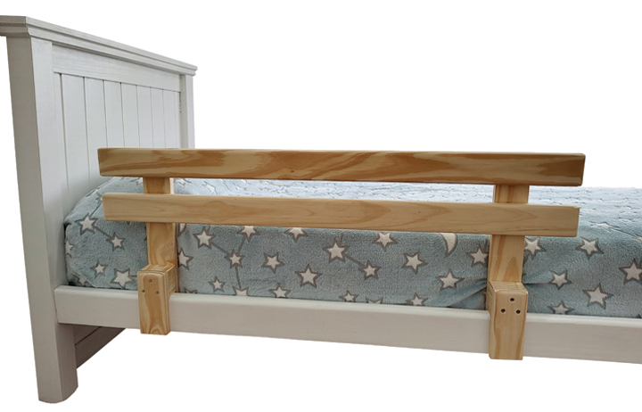

# Documentación de clases CSS reutilizables

Esta guía describe las clases principales de `estilos.css` para que puedas crear nuevas páginas fácilmente y mantener la coherencia visual.

---

## Estructura general
- `.container`: Contenedor principal, centra y da margen al contenido.
- `body.barandas` (o similar): Fondo y estilo base para cada módulo.

## Cabecera y subtítulo
- `h1`: Título principal, estilo destacado.
- `.subtitle`: Subtítulo debajo del título, fuente secundaria.

## Redes sociales
- `.socials`: Contenedor de íconos sociales, alineados horizontalmente.
- `.socials a`: Enlaces a redes, cada uno con su SVG.

## Zona de contenido
- `#contenido-personalizado`: Área donde se inserta el contenido específico de cada página (productos, tablas, etc).

## Tarjetas de producto
- `.product-card`: Tarjeta individual para cada producto.
- `.product-image`: Imagen del producto dentro de la tarjeta.
- `.product-table`: Tabla de atributos y precios.

## Botones
- `.buy-btn`: Botón de compra principal, color destacado.
- `.split-btn`: Barra de navegación inferior con dos botones (INICIO y CONSULTAR).
- `.split-btn a`: Estilos para los botones de navegación.
- `.consultar`: Botón de WhatsApp, color verde.

## Ejemplo de uso
```html
<div class="container">
  <h1>LA TARIMA</h1>
  <div class="subtitle">Carpintería Online</div>
  <div class="socials"> ... </div>
  <div id="contenido-personalizado">
    <div class="product-card">
      
      <table class="product-table"> ... </table>
      <a class="buy-btn" href="#">Comprar</a>
    </div>
  </div>
  <nav class="split-btn">
    <a href="index.html">INICIO</a>
    <a href="https://wa.me/5491167007723" class="consultar">CONSULTAR</a>
  </nav>
</div>
```

---

## Personalización
- Puedes combinar estas clases para cualquier módulo/producto.
- Si necesitas variantes, crea nuevas clases siguiendo la misma convención.

---

¿Quieres que agregue ejemplos visuales o snippets de CSS específicos?